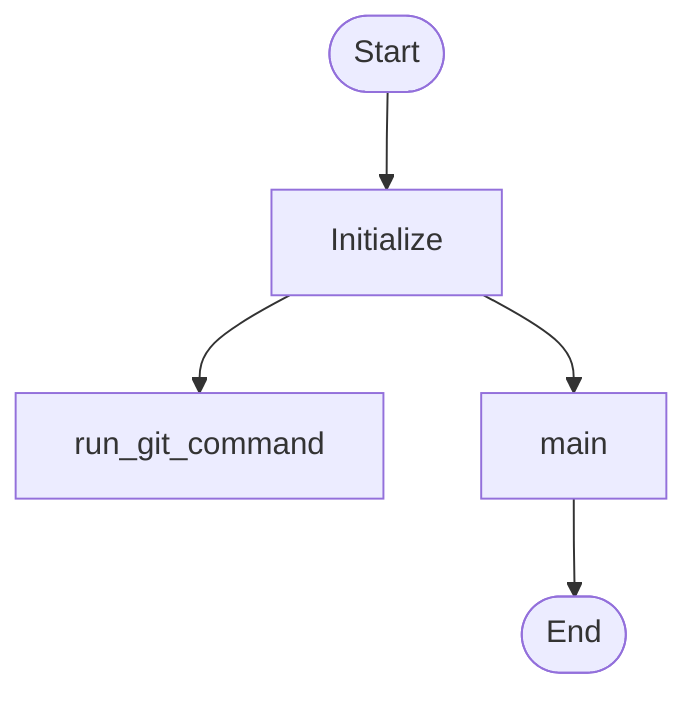
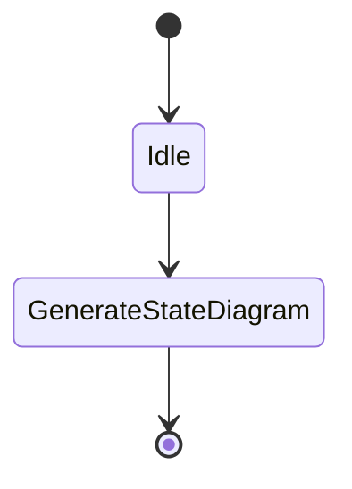
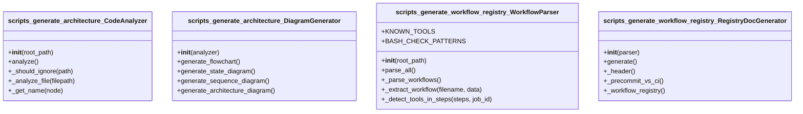
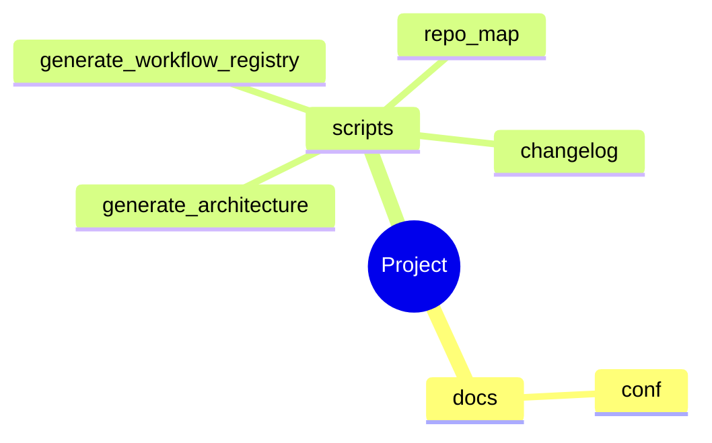
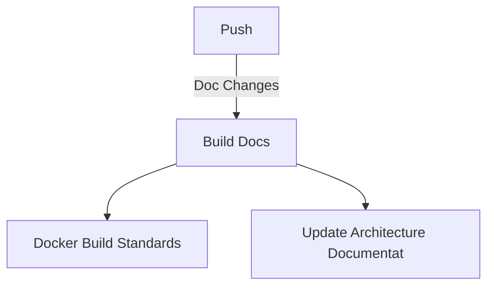
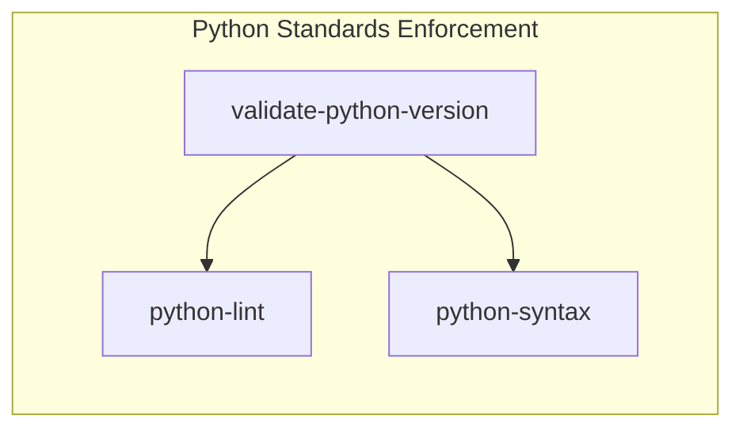

# Architecture (Auto-Generated)

**Generated:** 2026-02-12 04:13:55 **Project:** /home/runner/work/repo-standards/repo-standards

## Overview

Analyzed **5** Python modules containing:

- **4** classes
- **78** functions
- **0** async functions

### Detected Patterns

- ❌ **Api**
- ❌ **Async**
- ✅ **Cli**
- ❌ **Database**
- ❌ **Dataclass**
- ❌ **Orm**
- ❌ **Server**
- ✅ **State Machine**
- ✅ **Workflows**

## Flowchart Diagram



## State Diagram



## Sequence Diagram

*Sequence diagram not applicable for this codebase.*

## Architecture Diagram


## Er Diagram

*Er diagram not applicable for this codebase.*

## Class Diagram



## Journey Diagram

*Journey diagram not applicable for this codebase.*

## Mindmap Diagram



## Workflow Pipeline Diagram



## Workflow Triggers Diagram

```mermaid
graph TD
    reusable_makefile_ci[Makefile Standards Enforcement]
    reusable_config_validation[Config Standards Validation]
    reusable_yaml_ci[YAML Standards Enforcement]
    reusable_docker_build[Docker Build Standards]
    reusable_python_ci[Python Standards Enforcement]
    reusable_update_architecture[Update Architecture Documentation]
    reusable_shell_ci[Shell Script Standards Enforcement]
    reusable_pre_commit[Pre-commit Standards Enforcement]
    reusable_update_docs[Update Documentation (Reusable)]
    reusable_quality_checks[Advanced Quality Checks]
```

## Workflow Jobs Diagram



## Development Workflows

### GitHub Workflows Summary

| Workflow                           | Triggers | Jobs                                                        |
| ---------------------------------- | -------- | ----------------------------------------------------------- |
| Config Standards Validation        |          | validate-configs                                            |
| Docker Build Standards             |          | docker-build                                                |
| Makefile Standards Enforcement     |          | validate-makefile                                           |
| Pre-commit Standards Enforcement   |          | pre-commit                                                  |
| Python Standards Enforcement       |          | validate-python-version, python-lint, python-syntax         |
| Advanced Quality Checks            |          | detect-unused-python, detect-unused-shell, markdown-lint... |
| Shell Script Standards Enforcement |          | shellcheck, bash-syntax                                     |
| Update Architecture Documentation  |          | generate-architecture                                       |
| Update Documentation (Reusable)    |          | update-and-build-docs                                       |
| YAML Standards Enforcement         |          | validate-yaml                                               |

## Module Summary

### `docs.conf`

- **Classes:** 0
- **Functions:** 0
- **Async Functions:** 0

### `scripts.changelog`

changelog.py - Generate changelog from git history

Automatically generates and maintains a CHANGELOG.md file following the Keep a Changelog format using conventional
commits.

Usage: python3 chan...

- **Classes:** 0
- **Functions:** 8
- **Async Functions:** 0

### `scripts.generate_architecture`

generate_architecture.py - Comprehensive Architecture Diagram Generator

Generates multiple Mermaid diagram types based on codebase analysis:

- flowchart: Control flow and process flows

- stateDiagram...

- **Classes:** 2

- **Functions:** 26

- **Async Functions:** 0

### `scripts.generate_workflow_registry`

generate_workflow_registry.py - Generate workflow registry and tool coverage matrix

Parses all reusable GitHub Actions workflow YAML files and the pre-commit config to produce a comprehensive referen...

- **Classes:** 2
- **Functions:** 32
- **Async Functions:** 0

### `scripts.repo_map`

repo_map.py - Generate repository structure documentation

Automatically generates comprehensive repository structure documentation including directory trees, file descriptions,
and categorized overvi...

- **Classes:** 0
- **Functions:** 12
- **Async Functions:** 0

______________________________________________________________________

*Generated by: `generate_architecture.py` from repo-standards*
