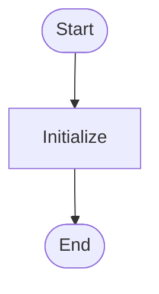
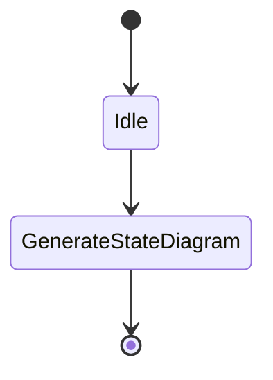
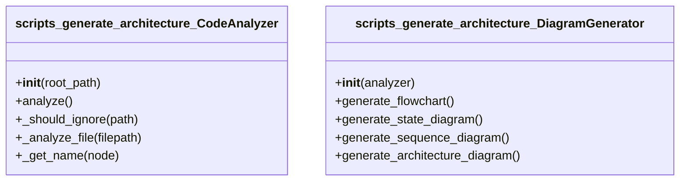
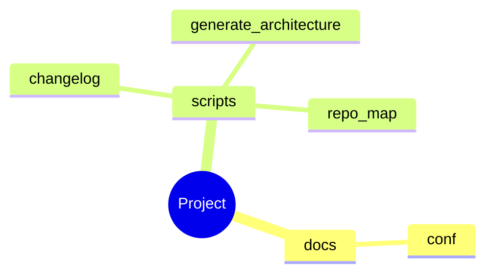
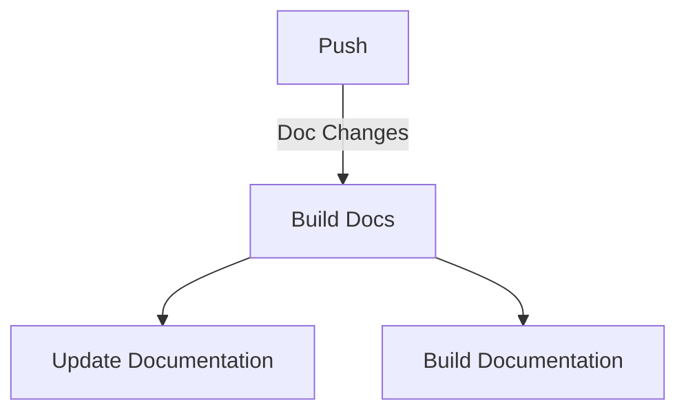
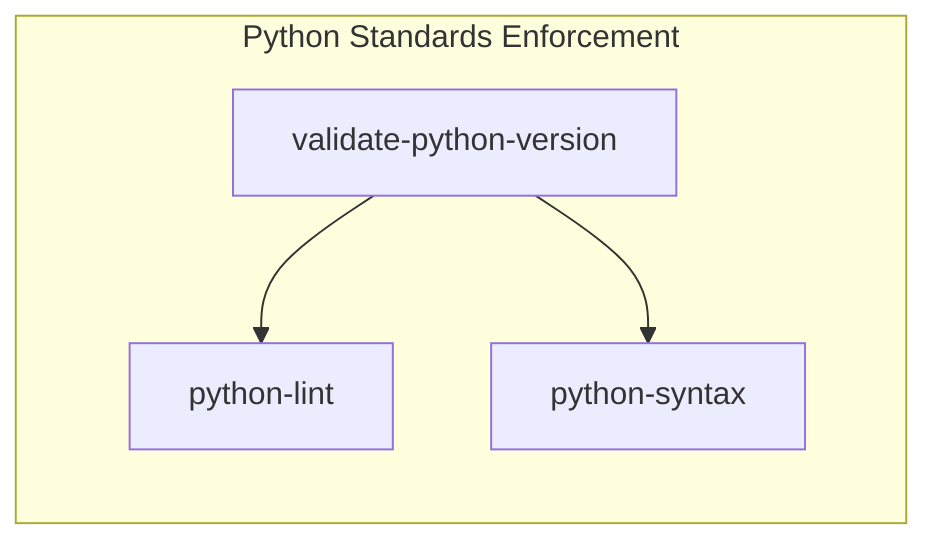

# Architecture (Auto-Generated)

**Generated:** 2026-02-08 09:55:37
**Project:** /home/zepfu/projects/repo-standards

## Overview

Analyzed **4** Python modules containing:
- **2** classes
- **46** functions
- **0** async functions

### Detected Patterns

- ❌ **Api**
- ❌ **Async**
- ✅ **Cli**
- ❌ **Database**
- ❌ **Dataclass**
- ❌ **Orm**
- ❌ **Server**
- ✅ **State Machine**
- ✅ **Workflows**

## Flowchart Diagram




## State Diagram




## Sequence Diagram

*Sequence diagram not applicable for this codebase.*


## Architecture Diagram


## Er Diagram

*Er diagram not applicable for this codebase.*


## Class Diagram




## Journey Diagram

*Journey diagram not applicable for this codebase.*


## Mindmap Diagram




## Workflow Pipeline Diagram




## Workflow Triggers Diagram

```mermaid
graph TD
    reusable_pre_commit[Pre-commit Standards Enforcement]
    update_docs[Update Documentation]
    reusable_config_validation[Config Standards Validation]
    reusable_shell_ci[Shell Script Standards Enforcement]
    ci[CI]
    build_docs[Build Documentation]
    reusable_update_docs[Update Documentation (Reusable)]
    reusable_update_architecture[Update Architecture Documentation]
    reusable_python_ci[Python Standards Enforcement]
    reusable_docker_build[Docker Build Standards]
```


## Workflow Jobs Diagram




## Development Workflows

### GitHub Workflows Summary

| Workflow | Triggers | Jobs |
|----------|----------|------|
| Build Documentation |  | check-ci-status, build-and-deploy |
| CI |  | validate-self, python-standards, shell-standards... |
| Config Standards Validation |  | validate-configs |
| Docker Build Standards |  | docker-build |
| Pre-commit Standards Enforcement |  | pre-commit |
| Python Standards Enforcement |  | validate-python-version, python-lint, python-syntax |
| Shell Script Standards Enforcement |  | shellcheck, bash-syntax |
| Update Architecture Documentation |  | generate-architecture |
| Update Documentation (Reusable) |  | update-docs |
| Update Documentation |  | generate-docs |

## Module Summary

### `docs.conf`

- **Classes:** 0
- **Functions:** 0
- **Async Functions:** 0

### `scripts.changelog`

changelog.py - Generate changelog from git history

Automatically generates and maintains a CHANGELOG.md file following the
Keep a Changelog format using conventional commits.

Usage:
    python3 chan...

- **Classes:** 0
- **Functions:** 8
- **Async Functions:** 0

### `scripts.generate_architecture`

generate_architecture.py - Comprehensive Architecture Diagram Generator

Generates multiple Mermaid diagram types based on codebase analysis:
- flowchart: Control flow and process flows
- stateDiagram...

- **Classes:** 2
- **Functions:** 26
- **Async Functions:** 0

### `scripts.repo_map`

repo_map.py - Generate repository structure documentation

Automatically generates comprehensive repository structure documentation
including directory trees, file descriptions, and categorized overvi...

- **Classes:** 0
- **Functions:** 12
- **Async Functions:** 0

---

*Generated by: `generate_architecture.py` from repo-standards*
